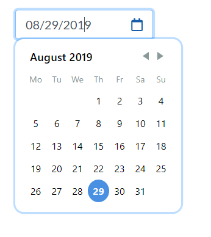

# Welcome to datepicker-multi-language!

> Hi! It's a React component to build a customized UI of
> https://react-day-picker.js.org.
> 
> It's too a calendar multi-language for React.
>
> **Install-package** 
> - npm install chalo-datepicker-multi-language
> - yarn add chalo-datepicker-multi-language

## What does it?

 - Show a box field displaying a calendar.
 - It accepts the followings the date format:
	 - MM/DD/YYYY
	 - M/D/YYYY
	 - MM/D/YYYY
	 - M/DD/YYYY
 - It can translate the calendar to the followings  languages: 
	 - English
	 - Spanish

## How to implated it?

You can see the example complete in directory  **src/example/ExampleImplementation.js**

```JavaScript
    // src/example/ExampleImplementation.js
    ...
    constructor(props) {    
        super(props);    
        //It gets a new date to show in InputDatePicker
        this.state = {
            date:new Date()
        };       
    }

    //It's a method to change the date in InputDatePicker
    handleChangeDate(date) {
      this.setState({date});
    }

    render () {
        return (<InputDatePicker
                    //Translate to English
                    locale="en-US"
                     //Translate to Spanish
                    //locale="es"
                    date={this.state.date}
                    handleChange={this.handleChangeDateto}
                />)
    }
```


